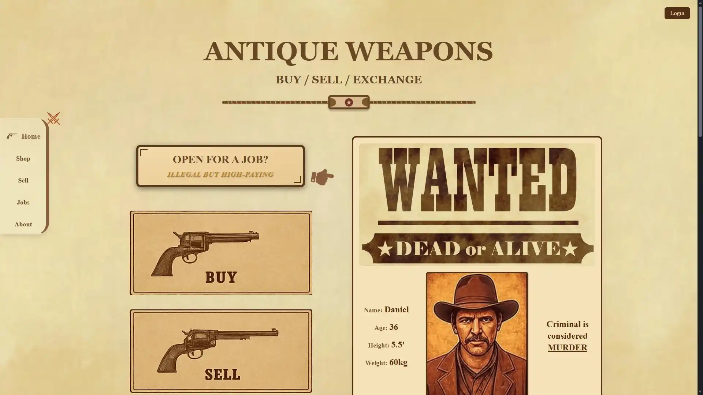
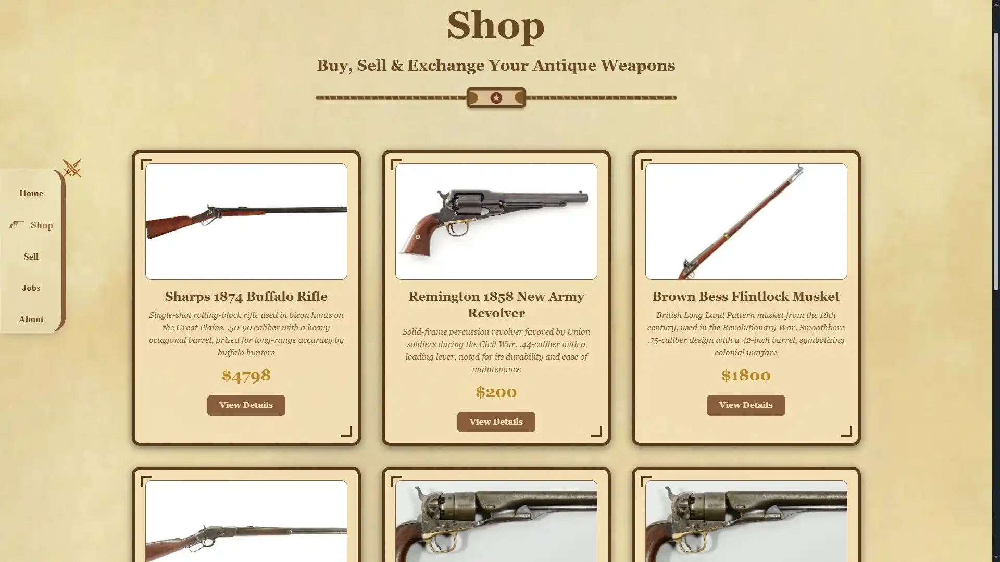
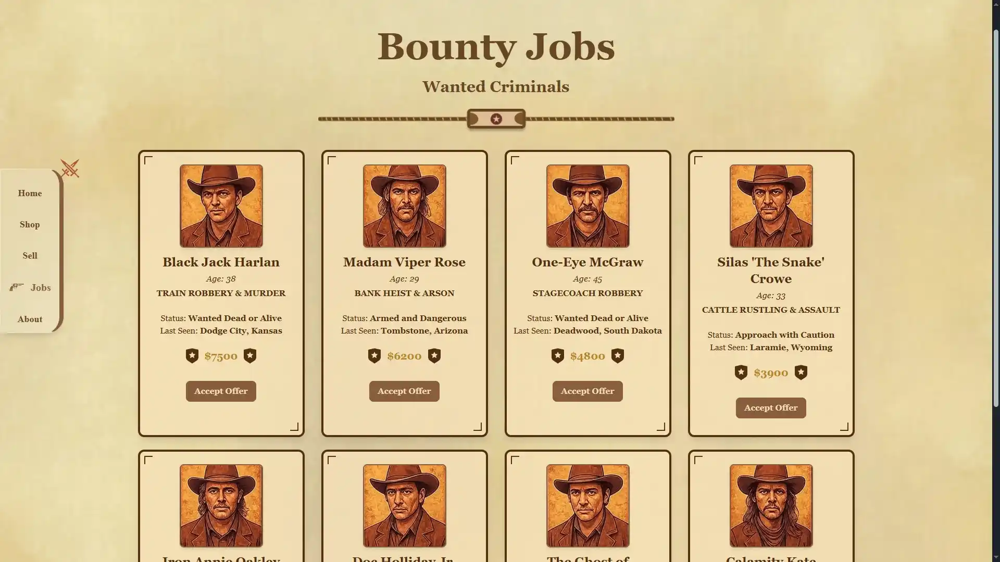

# 🔫 Antique Weapon Marketplace  
### _Buy | Sell | Exchange | Collect_

A full-stack **vintage weapon trading platform** built with **React, Tailwind CSS, Node.js, Express, and MongoDB** — featuring a wild west inspired UI, animated shop section, and job listing system for bounty hunters 🔥  

## Live Link

https://antique-weapons-client.vercel.app/

---

## 🖼️ Preview  
> ✨ *Old West vibes meet modern web technology!*

---

## ⚙️ Features  

✅ **Buy, Sell, or Exchange** rare antique firearms  
✅ **Wanted/Bounty Job Board** for fun western themes  
✅ **Dynamic Shop Page** with animations & filters  
✅ **Weapon Detail Page** for individual listings  
✅ **Connected MongoDB Backend**  
✅ **Modern UI** powered by Tailwind CSS + React  
✅ **Fully Responsive** across all devices  

---

## 🧠 Tech Stack  

### 🖥️ Frontend  

  

### ⚙️ Backend  

  

---

## 🎨 UI Theme 
> Inspired by Wild West aesthetics, with parchment textures, dark wood tones, and classic serif fonts for an authentic look 🤠

## 👨‍💻 Developer

Sadnan Zaman

🕹️ Web Developer | 🎯 Focused on Full-Stack JS | 💻 Passionate about Game & Tech
